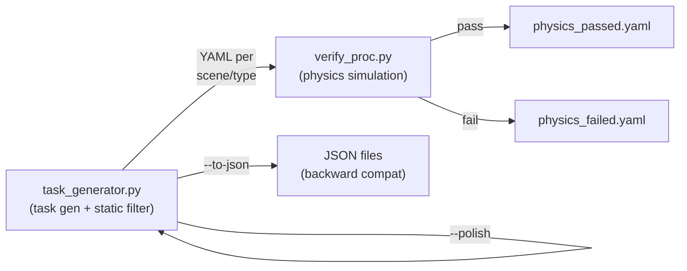

<p align="center">
  
</p>

<h1 align="center">REAL: Exploratory, Communicative, and Deployable Embodied Agents</h1>

<p align="center">
  <a href="https://github.com/InternRobotics/REAL"></a>
  
  
  
  
</p>

---

## 📰 News

* **[2026.03.31]** 🔥🔥 **Phase 2 Released** — Procedural task & trajectory generation pipeline (GRScenes + MesaTask) is now open-source!
* **[2026.03.24]** 🔥🔥 **Phase 1 Released** — Simulation engine (InternUtopia), nanobot interface, and MCP server are now open-source!

---

## Introduction

**REAL** is an open-source framework for exploratory, communicative, and deployable embodied agents in household manipulation tasks. Agents interact with simulation and robot backends through [Model Context Protocol (MCP)](https://modelcontextprotocol.io/) tool calls and receive multimodal observations consisting of RGB images and structured text.

### Repository layout

| Path | Purpose |
|------|---------|
| `mcp_server/` | MCP tools, server, perception utilities, and simulation environment setup |
| `configs/` | Portable demo task configuration |
| `proc_datagen/` | Procedural task generation, annotation, and physics verification |
| `training/qwen3vl_sft/` | Public Qwen3-VL SFT launch and dataset templates |
| `scripts/` | Demo and batch-processing entrypoints |

### 🌟 Key Highlights

* **MCP-native interface**: Exposes action primitives as standard MCP tools over SSE/HTTP — any MCP-compatible agent (Claude, GPT-4o, local models) can plug in without modification.
* **Multimodal observations**: Every tool call returns an RGB image plus structured text feedback, enabling vision-language agents to reason about the scene.
* **Physics-based simulation**: Built on [InternUtopia](https://github.com/InternRobotics/InternUtopia) (Isaac Sim), providing realistic object interactions and articulated manipulation.
* **End-to-end pipeline**: From simulation through evaluation to training — a unified framework covering the full embodied AI development cycle.

---

## Demo

https://github.com/user-attachments/assets/b5d2424b-9a75-43d2-a33f-d657c9fd28f1


---

## Roadmap

| Stage | Status | Description |
|-------|--------|-------------|
| Phase 1 | ✅ **Released** | Simulation engine (InternUtopia), nanobot interface, MCP server |
| Phase 2 | ✅ **Released** | Task & trajectory generation pipeline (GRScenes + MesaTask) |
| Phase 3 | ✅ **SFT templates released** | Qwen3-VL SFT launch templates and data config examples; RL training coming soon |
| - | 🔜 Coming soon | Technical report |


---

## Available MCP Tools

| Tool | Description |
|------|-------------|
| `list_receptacles` | List all receptacles by room |
| `navigate_to` | Navigate to a furniture receptacle |
| `explore_receptacle` | Survey all objects on the current receptacle |
| `focus_on` | Focus camera on a specific object by marker ID |
| `find_objects` | Find and highlight objects of a given category in view |
| `highlight_receptacles` | Highlight all visible receptacle surfaces |
| `pick` | Pick up an object by marker ID |
| `place` | Place held object onto a receptacle surface |
| `open` / `close` | Operate articulated doors |


Each tool call returns an RGB observation image and structured text feedback from the simulation.

---

## Quick Start

### 1. Clone with submodules

```bash
git clone --recurse-submodules https://github.com/InternRobotics/REAL.git
cd REAL
```

### 2. Install the InternUtopia

Please refer to the InternUtopia [documentation](https://internrobotics.github.io/user_guide/internutopia/get_started/installation.html).

### 3. Install other dependencies

```bash
pip install -r requirements.txt
```

Optional Qwen3-VL training dependencies are managed by the upstream Qwen3-VL fine-tuning environment rather than this runtime requirements file.

### 4. Download and unpack assets

Download `assets.tar.gz` from the [google drive](https://drive.google.com/drive/folders/15RXHNisGn5SZTLvFWYkdKKazNvxaRrVd?usp=sharing), extract to the repo path.


The `assets/` directory should scenes, models, objects, materials, and metadata required by the demo.

Copy `.env.example` to `.env` only when you need an OpenAI-compatible perception endpoint. Never commit the populated `.env` file.

### 5. Run the demo MCP server

```bash

./scripts/demo/run_mcp_server_demo.sh

```

The server binds to `127.0.0.1:8080` by default. Override it with `HOST=<host>` and `PORT=<port>`, then connect an MCP-compatible agent to `http://127.0.0.1:8080/sse`.


### 6. Connect with nanobot (MCP Client)

[nanobot](https://github.com/EmbodiedClaw/nanobot) is a lightweight MCP client that lets you chat with the simulation via any LLMs.

**Step 1 — Install nanobot**

Follow the installation instructions in the [nanobot repository](https://github.com/EmbodiedClaw/nanobot).

**Step 2 — Configure nanobot**

In the nanobot config file, add the Isaac Sim MCP server under `tools → mcpServers`:

```json
{
  "tools": {
    "mcpServers": {
      "real": {
        "url": "http://127.0.0.1:8080/sse",
        "type": "sse",
        "toolTimeout": 300,
        "no_proxy": true
      }
    }
  }
}
```

**Step 3 — Run nanobot gateway**

```bash
nanobot gateway
```

You can now chat with the agent and issue manipulation commands through the simulation.

---

## Task Generation Pipeline

The procedural task generation pipeline lives in `proc_datagen/`. It produces pick-and-place task configs for training and evaluation, in two stages:



### Task types

| Type | Description |
|------|-------------|
| `basic` | Simple pick-and-place with same-type furniture distractors |
| `distractor` | Same-category object distractors; uses `detailed_caption` for grounding |
| `articulation` | Store / retrieve involving articulated furniture (open/close door) |
| `interactive` | Same-purpose different-category distractors + fuzzy description (requires user interaction to disambiguate) |
| `gather` | Multi-source gather: collect N objects to one destination |

### Asset setup — MesaTask USD files

The task generator relies on object USD files from the [MesaTask dataset](https://huggingface.co/datasets/InternRobotics/MesaTask-10K).  After downloading, set `MESATASK_USD_ROOT` to the directory containing the `.usd` files before running any pipeline script:

```bash
export MESATASK_USD_ROOT=/path/to/mesatask_download/object_usds
```

The metadata file `assets/metadata/consolidated_asset_library_with_size.json` stores only filenames (e.g. `abc123.usd`); the code resolves them against `MESATASK_USD_ROOT` at runtime.

### Stage 1 — Task generation & static filtering

```bash
# Generate all 5 task types, with inline static placement check
# Output: proc_datagen/configs/{scene_id}/{task_type}.yaml
python proc_datagen/task_generator.py \
    --tasks all \
    --output-dir proc_datagen/configs \
    --verify-placement \
    --occ-map-root assets/metadata \
    --seed 42

# Generate only specific types
python proc_datagen/task_generator.py \
    --tasks interactive gather \
    --output-dir proc_datagen/configs

# Polish task descriptions with an LLM after generation
# (requires OPENAI_API_KEY and openai package)
python proc_datagen/task_generator.py \
    --tasks all \
    --output-dir proc_datagen/configs \
    --verify-placement \
    --polish

# Also export flat JSON files (backward compat)
python proc_datagen/task_generator.py \
    --tasks all \
    --output-dir proc_datagen/configs \
    --verify-placement \
    --to-json
```

Output: `proc_datagen/configs/{scene_id}/{task_type}.yaml` — per-scene per-type YAML files containing `objects` (with positions) and `episodes` (with placements).

### Stage 2 — Physics verification

Run physics simulation to filter out tasks where objects fall or leave the surface:

```bash
# Verify all scenes and merge results (default)
./scripts/filter/batch_filter_proc.sh

# Only run physics (skip merge)
./scripts/filter/batch_filter_proc.sh --stage physics

# Only merge already-finished results
./scripts/filter/batch_filter_proc.sh --stage merge
```

Results per task type:

```
proc_datagen/verify_results/{task_type}/
    physics_valid.yaml                     # merged passing episodes across all scenes
    {scene_id}/physics_passed.yaml         # per-scene passing episodes
    {scene_id}/physics_failed.yaml         # per-scene failed episodes
```

To run a single scene manually (e.g. for debugging):

```bash
TASK_SOURCE_PATH=proc_datagen/configs/MVUCSQAKTKJ5EAABAAAAABQ8/interactive.yaml \
OUTPUT_PATH=proc_datagen/verify_results/interactive/MVUCSQAKTKJ5EAABAAAAABQ8 \
python proc_datagen/verify_proc.py --max-tasks 20
```

---

## Qwen3-VL SFT Training

REAL provides public launch templates and dataset configuration examples for supervised fine-tuning on top of the official Qwen3-VL fine-tuning workflow. Reproduction requires cloning the official Qwen3-VL repository and setting up its official fine-tuning environment first.

See [training/qwen3vl_sft/README.md](training/qwen3vl_sft/README.md) for the full training guide, launch script, data config example, DeepSpeed config, and minimal dataset example.

The template entrypoint is:

```bash
git clone https://github.com/QwenLM/Qwen3-VL.git
export QWEN3VL_FINETUNE_ROOT=/path/to/Qwen3-VL/qwen-vl-finetune
hf download Qwen/Qwen3-VL-8B-Instruct \
    --local-dir models/Qwen3-VL-8B-Instruct
export MODEL_NAME_OR_PATH=models/Qwen3-VL-8B-Instruct
export DATASETS=real_basic_pnp

bash training/qwen3vl_sft/train_qwen3vl_sft.sh
```

This repository does not publish private cluster scripts, internal data paths, service credentials, model weights, or RL training code.

---


## 📑 Citation

The paper citation will be added after publication. Until then, please cite this repository URL and the paper title:

> Exploratory, Communicative, and Deployable: Vision-Driven Embodied Agents for Open-World Mobile Manipulation.

---

## Acknowledgement

REAL is built on top of [**InternUtopia**](https://github.com/InternRobotics/InternUtopia) and [**nanobot**](https://github.com/EmbodiedClaw/nanobot).

We thank the teams behind [**Model Context Protocol**](https://modelcontextprotocol.io/) and [**NVIDIA Isaac Sim**](https://developer.nvidia.com/isaac-sim) for their foundational work.

---

## License

This project is licensed under the [MIT License](LICENSE).
