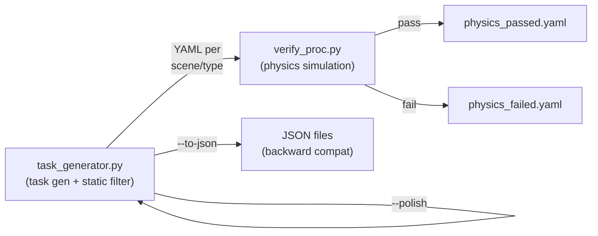

<p align="center">
  
</p>

<h1 align="center">REAL: Exploratory, Communicative, and Deployable Embodied Agents</h1>

<p align="center">
  <a href="https://huggingface.co/datasets/InternRobotics/REAL-Data"></a>
  <a href="#dataset--checkpoint"></a>
  <a href="https://arxiv.org/abs/2607.13653"></a>
  <a href="https://internrobotics.github.io/REAL/"></a>
  <a href="https://github.com/InternRobotics/REAL"></a>
  
</p>

---

## 📰 News

* **[2026.07.15]** 🤗 [REAL-Data](https://huggingface.co/datasets/InternRobotics/REAL-Data), including the seven experiment-processed GRScenes stages, is now available.
* **[2026.06.18]** 🎉 Our paper has been accepted to **ECCV 2026**! 🥳
* **[2026.06.01]** 🚀 Training code released.
* **[2026.03.31]** Procedural task generation and trajectory annotation utilities released.
* **[2026.03.24]** Simulation environment and MCP server released.

---

## Introduction

**REAL** is a sim-to-real-consistent framework for interactive open-world mobile manipulation. Agents explore from raw RGB observations, use deployable navigation and manipulation tools, and communicate with a simulated user to resolve ambiguous instructions without privileged simulator information.

### Contributions

* **REAL framework**: Non-privileged visual exploration with interactive intent alignment and an MCP-based tool interface.
* **Training and benchmark**: A hierarchical SFT and online RL pipeline evaluated on REAL-Bench, which contains 241 tasks across four task families.
* **Sim-to-real deployment**: 56.9% success on interactive tasks and 78.3% success over 60 real-world robot episodes.

### Repository layout

| Path | Purpose |
|------|---------|
| `mcp_server/` | MCP tools, server, perception utilities, and simulation environment setup |
| `configs/` | Portable demo task configuration |
| `proc_datagen/` | Procedural task generation, annotation, and physics verification |
| `training/qwen3vl_sft/` | Public Qwen3-VL SFT launch and dataset templates |
| `scripts/` | Demo and batch-processing entrypoints |

### Online RL branch

The MCP-based online GRPO runtime is maintained on the [`gspo`](../../tree/gspo)
branch under `training/mcp_gspo/`. It is kept separate from `main` because it
depends on the ms-swift rollout stack and external MCP workers rather than the
public demo runtime. To use it, fetch the branch and switch explicitly:

```bash
git fetch origin gspo
git switch gspo
```

---

## Available MCP Tools

| Tool | Description |
|------|-------------|
| `list_receptacles` | List all receptacles by room |
| `navigate_to` | Navigate to a furniture receptacle |
| `explore_receptacle` | Survey all objects on the current receptacle |
| `focus_on` | Focus camera on a specific object by marker ID |
| `find_objects` | Find and highlight objects of a given category in view |
| `highlight_receptacles` | Highlight all visible receptacle surfaces |
| `pick` | Pick up an object by marker ID |
| `place` | Place held object onto a receptacle surface |
| `open` / `close` | Operate articulated doors |
| `ask` | Query the deterministic simulated user for the task's target description |


Each tool call returns an RGB observation image and structured text feedback from the simulation.

---

## Quick Start

### 1. Clone with submodules

```bash
git clone --recurse-submodules https://github.com/InternRobotics/REAL.git
cd REAL
```

### 2. Install InternUtopia

Please refer to the InternUtopia [documentation](https://internrobotics.github.io/user_guide/internutopia/get_started/installation.html).

### 3. Install other dependencies

```bash
pip install -r requirements.txt
```

Optional Qwen3-VL training dependencies are managed by the upstream Qwen3-VL fine-tuning environment rather than this runtime requirements file.

### 4. Download and install REAL-Data

The public [REAL-Data](https://huggingface.co/datasets/InternRobotics/REAL-Data)
bundle contains the seven processed scene entry points, their complete
model/material dependency closure, occupancy maps, and generator metadata. It
does **not** contain MesaTask object USDs.

Install the current Hugging Face CLI if `hf` is not already available, and
ensure the `zstd` command is installed:

```bash
python -m pip install -U huggingface_hub
```

From the REAL repository root, download, verify, and extract the bundle into
the `assets/` layout expected by the configs and pipeline scripts:

```bash
hf download InternRobotics/REAL-Data \
  data/REAL-Data.tar.zst \
  data/REAL-Data.tar.zst.sha256 \
  --repo-type dataset \
  --local-dir data/REAL-Data-download

(cd data/REAL-Data-download/data && \
  sha256sum -c REAL-Data.tar.zst.sha256)

# Start from a clean destination; assets/ is intentionally gitignored.
test ! -e assets || {
  echo "assets/ already exists; move or remove it before extracting REAL-Data" >&2
  exit 1
}
mkdir assets
tar -I zstd -xf data/REAL-Data-download/data/REAL-Data.tar.zst \
  --strip-components=1 \
  -C assets

# Verify all 6,205 payload files plus the manifest.
(cd assets && sha256sum -c SHA256SUMS)
```

The downloaded archive SHA256 is
`dab362cdeb23a01c192ae4a0a5a87d6c00aad99e023f5d7dd15d4831c2a6f96f`.
After extraction, at minimum these paths must exist:

```text
assets/scenes/MVUCSQAKTKJ5EAABAAAAABY8_usd/scene.usd
assets/metadata/MVUCSQAKTKJ5EAABAAAAABY8/occupancy.npy
assets/metadata/MVUCSQAKTKJ5EAABAAAAABY8/scene_furniture_library.json
assets/metadata/consolidated_asset_library_with_size.json
```

### 5. Download MesaTask objects

Download [MesaTask-10K](https://huggingface.co/datasets/InternRobotics/MesaTask-10K)
separately. Preserve its object/texture layout, then point
`MESATASK_USD_ROOT` at the flat directory containing the object `.usd` files:

```bash
export MESATASK_USD_ROOT=/path/to/mesatask_download/object_usds
```

The default demo directly reuses the two objects listed in
`assets/mesa_required.txt`. Check them before starting Isaac Sim:

```bash
while IFS= read -r usd; do
  test -f "$MESATASK_USD_ROOT/$usd" || {
    echo "Missing MesaTask object: $MESATASK_USD_ROOT/$usd" >&2
    exit 1
  }
done < assets/mesa_required.txt
```

### 6. Configure the optional perception endpoint

No endpoint is needed for exact category matching or any non-perception MCP
tool. Copy `.env.example` to `.env` only when fuzzy category matching is
needed. The demo launcher loads this file automatically without overriding
variables already exported by the caller. Never commit the populated `.env`
file.

### 7. Run the demo MCP server

Run the launcher from the repository root in the InternUtopia/Isaac Sim
environment. It opens the Omniverse GUI, so a working display is required:

```bash
./scripts/demo/run_mcp_server_demo.sh
```

The server binds to `127.0.0.1:8080` by default. Override it with `HOST=<host>` and `PORT=<port>`, then connect an MCP-compatible agent to `http://127.0.0.1:8080/sse`.


## Task Generation Pipeline

The procedural task generation pipeline lives in `proc_datagen/`. It produces pick-and-place task configs for training and evaluation, in two stages:



### Task types

| Type | Description |
|------|-------------|
| `basic` | Simple pick-and-place with same-type furniture distractors |
| `distractor` | Same-category object distractors; uses `detailed_caption` for grounding |
| `articulation` | Store / retrieve involving articulated furniture (open/close door) |
| `interactive` | Same-purpose different-category distractors + fuzzy description (requires user interaction to disambiguate) |
| `gather` | Multi-source gather: collect N objects to one destination |

### Asset setup — MesaTask USD files

Complete Quick Start steps 4–5 before running the pipeline. All default scene
and metadata paths resolve under the extracted `assets/` directory. The task
generator and physics verifier resolve relative MesaTask filenames against
`MESATASK_USD_ROOT`:

```bash
export MESATASK_USD_ROOT=/path/to/mesatask_download/object_usds
```

The metadata file `assets/metadata/consolidated_asset_library_with_size.json` stores only filenames (e.g. `abc123.usd`); the code resolves them against `MESATASK_USD_ROOT` at runtime.

Articulation episodes use `task_type: articulation` and preserve the operation
as `articulation_subtype: store|retrieve`; both subtypes are written to the
same `articulation.yaml` file.

### Stage 1 — Task generation & static filtering

```bash
# Generate all 5 task types, with inline static placement check
# Output: proc_datagen/configs/{scene_id}/{task_type}.yaml
python proc_datagen/task_generator.py \
    --tasks all \
    --output-dir proc_datagen/configs \
    --verify-placement \
    --occ-map-root assets/metadata \
    --seed 42

# Generate only specific types
python proc_datagen/task_generator.py \
    --tasks interactive gather \
    --output-dir proc_datagen/configs

# Polish task descriptions with an LLM after generation
# (requires OPENAI_API_KEY and openai package; defaults to gpt-4o-mini)
export OPENAI_MODEL=gpt-4o-mini
python proc_datagen/task_generator.py \
    --tasks all \
    --output-dir proc_datagen/configs \
    --verify-placement \
    --polish

# Also export flat JSON files (backward compat)
python proc_datagen/task_generator.py \
    --tasks all \
    --output-dir proc_datagen/configs \
    --verify-placement \
    --to-json
```

Polishing retries transient failures three times and then exits with an error;
it never silently writes the unpolished input as if the request succeeded.

Output: `proc_datagen/configs/{scene_id}/{task_type}.yaml` — per-scene per-type YAML files containing `objects` (with positions) and `episodes` (with placements).

### Stage 2 — Physics verification

Run physics simulation to filter out tasks where objects fall or leave the surface:

The provided batch script processes `articulation`, `interactive`, `distractor`, and `gather`. The `basic` task type can be checked manually with `verify_proc.py` using the same environment variables shown below.

```bash
# Verify all scenes and merge results (default)
./scripts/filter/batch_filter_proc.sh

# Only run physics (skip merge)
./scripts/filter/batch_filter_proc.sh --stage physics

# Only merge already-finished results
./scripts/filter/batch_filter_proc.sh --stage merge
```

Results per task type:

```
proc_datagen/verify_results/{task_type}/
    physics_valid.yaml                     # merged passing episodes across all scenes
    {scene_id}/physics_passed.yaml         # per-scene passing episodes
    {scene_id}/physics_failed.yaml         # per-scene failed episodes
```

To run a single scene manually (e.g. for debugging):

```bash
TASK_SOURCE_PATH=proc_datagen/configs/MVUCSQAKTKJ5EAABAAAAABQ8/interactive.yaml \
OUTPUT_PATH=proc_datagen/verify_results/interactive/MVUCSQAKTKJ5EAABAAAAABQ8 \
python proc_datagen/verify_proc.py --max-tasks 20
```

---

## Trajectory Annotation

`proc_datagen/trajectory_annotation/` converts existing replay PKL files and their metadata into step-level JSON annotations using an OpenAI-compatible multimodal endpoint. It annotates previously recorded trajectories; it does not record trajectories itself.

Provide `OPENAI_API_KEY` and, when needed, `OPENAI_BASE_URL` and `OPENAI_MODEL`. Create a job configuration based on `proc_datagen/trajectory_annotation/config_example.json`, then run:

```bash
python proc_datagen/trajectory_annotation/annotate_trajectory.py \
    --config /path/to/trajectory_annotation_config.json
```

Do not commit credentials, private replay data, or machine-specific paths.

---

## Qwen3-VL SFT Training

REAL provides public launch templates and dataset configuration examples for supervised fine-tuning on top of the official Qwen3-VL fine-tuning workflow. Reproduction requires cloning the official Qwen3-VL repository and setting up its official fine-tuning environment first.

See [training/qwen3vl_sft/README.md](training/qwen3vl_sft/README.md) for the full training guide, launch script, data config example, DeepSpeed config, and minimal dataset example.

The template entrypoint is:

```bash
git clone https://github.com/QwenLM/Qwen3-VL.git
export QWEN3VL_FINETUNE_ROOT=/path/to/Qwen3-VL/qwen-vl-finetune
hf download Qwen/Qwen3-VL-8B-Instruct \
    --local-dir models/Qwen3-VL-8B-Instruct
export MODEL_NAME_OR_PATH=models/Qwen3-VL-8B-Instruct
export DATASETS=real_basic_pnp

bash training/qwen3vl_sft/train_qwen3vl_sft.sh
```

This branch does not publish private cluster scripts, internal data paths,
service credentials, or model weights. The version-controlled online RL runtime
is available on the `gspo` branch; private deployment topology and credentials
remain excluded there as well.

---


## 📑 Citation

The paper citation will be added after publication. Until then, please cite this repository URL and the paper title:

> Exploratory, Communicative, and Deployable: Vision-Driven Embodied Agents for Open-World Mobile Manipulation.

---

## Resources

### Dataset & Checkpoint

[**REAL-Data**](https://huggingface.co/datasets/InternRobotics/REAL-Data) is
publicly available on Hugging Face. It contains the seven processed GRScenes
stages, their portable scene dependency closure, and runtime/generator
metadata. MesaTask object USDs remain a separate download from
[MesaTask-10K](https://huggingface.co/datasets/InternRobotics/MesaTask-10K).

The model checkpoint link will be added after release.

The scene release contains the **seven experiment-processed GRScenes stages**,
not the original same-ID GRScenes stages. Maintainers build the portable bundle
with InternUtopia's `export_scenes.py` through
[`scripts/data/export_processed_grscenes.py`](scripts/data/export_processed_grscenes.py).
The wrapper selects the exact processed entries, localizes every dependency,
checks recursive USD/MDL closure, and emits a manifest plus checksums. The
non-duplicating layout, command, provenance requirements, and release gates are
documented in [Minimal Data Release](docs/minimal-data-release.md).

### Paper

The paper link will be added here after publication.

### Project Page

[REAL project page](https://internrobotics.github.io/REAL/)

---

## Acknowledgement

REAL is built on top of [**InternUtopia**](https://github.com/InternRobotics/InternUtopia).

We thank the teams behind [**Model Context Protocol**](https://modelcontextprotocol.io/) and [**NVIDIA Isaac Sim**](https://developer.nvidia.com/isaac-sim) for their foundational work.

---

## License

The code in this repository is licensed under the [MIT License](LICENSE).
[REAL-Data](https://huggingface.co/datasets/InternRobotics/REAL-Data) is a
derived data artifact released under CC BY-NC-SA 4.0; the MIT code license does
not replace its data terms.
