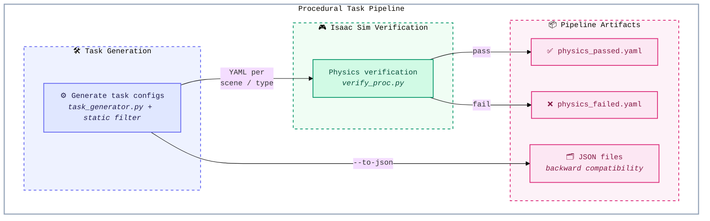

<p align="center">
  
</p>

<h1 align="center">REAL: Exploratory, Communicative, and Deployable Embodied Agents</h1>

<p align="center">
  <a href="benchmark/"></a>
  <a href="https://arxiv.org/abs/2607.13653"></a>
  <a href="https://internrobotics.github.io/REAL/"></a>
  <a href="https://github.com/InternRobotics/REAL"></a>
  
</p>

---

## 📰 News

* **[2026.07.15]** 📄 Our paper is available on [arXiv](https://arxiv.org/abs/2607.13653).
* **[2026.07.15]** 🚀 The official 241-task [REAL-Bench](benchmark/) definitions are released.
* **[2026.06.18]** 🎉 Our paper has been accepted to **ECCV 2026**! 🥳

---

## Introduction

**REAL** is a sim-to-real-consistent framework for interactive open-world mobile manipulation. Agents explore from raw RGB observations, use deployable navigation and manipulation tools, and communicate with a simulated user to resolve ambiguous instructions without privileged simulator information.

### Contributions

* **REAL framework**: Non-privileged visual exploration with interactive intent alignment and an MCP-based tool interface.
* **Training and benchmark**: A hierarchical SFT and online RL pipeline evaluated on REAL-Bench, which contains 241 tasks across four task families.
* **Sim-to-real deployment**: 56.9% success on interactive tasks and 78.3% success over 60 real-world robot episodes.

---

## Run REAL

Follow the six sections below in order to set up the repository, prepare the required assets, launch the MCP runtime, generate tasks and trajectories, evaluate agents, and train models.

### 1. Clone the Code and Install the Environment

#### Clone with submodules

```bash
git clone --recurse-submodules https://github.com/InternRobotics/REAL.git
cd REAL
```

#### Install InternUtopia

Install InternUtopia and its Isaac Sim environment by following the
[InternUtopia installation guide](https://internrobotics.github.io/user_guide/internutopia/get_started/installation.html).

#### Install runtime dependencies

Activate the InternUtopia/Isaac Sim Python environment, then install the REAL runtime dependencies:

```bash
python -m pip install -r requirements.txt
python -m pip check
```

The pinned MCP stack is verified with Isaac Sim 4.5.0 and Python 3.10.15. REAL
requires `mcp==1.9.4` and `httpx==0.28.1`. Do not install the optional
`internutopia_extension/agents/mobile_manipulation_agent/requirements.txt` or
`social_navigation_agent/requirements.txt` into the same environment: those
agent-specific files pin `httpx==0.25.2`, which is below MCP's required
`httpx>=0.27`. Use a separate environment if those optional InternUtopia agents
are also needed.

The local Qwen inference packages are installed separately in
[Section 5](#5-use-real-agents-and-evaluate-models). SFT and online RL use the
training environments described in [Section 6](#6-train-with-sft-and-online-rl).

#### Repository layout

| Path | Purpose |
|------|---------|
| `benchmark/` | Official 241-task REAL-Bench definitions and metadata |
| `real_bench/` | YAML REAL-Bench loader and validator |
| `agents/` | Qwen and OpenAI-compatible VLM agents for the MCP server |
| `mcp_server/` | MCP tools, server, perception utilities, and simulation setup |
| `configs/` | Portable demo task configuration |
| `proc_datagen/` | Procedural task generation, annotation, and physics verification |
| `training/qwen3vl_sft/` | Qwen3-VL SFT launch and dataset templates |
| `scripts/` | Demo, filtering, replay, and batch-processing entrypoints |

### 2. Download Benchmark Dependencies and Simulation Assets

#### Release contents

The repository already contains the official REAL-Bench task definitions. No separate download is required for the 241 YAML tasks. The release contains a basename-only MesaTask object lock (`benchmark/mesa_required.txt`), but does not include scene assets, MesaTask object USDs, trajectories, training data, or model checkpoints.

#### REAL-Bench usage

[`benchmark/tasks/`](benchmark/tasks/) contains one eval-server YAML per episode,
grouped as `tasks/<family>/<task_id>.yaml`. Each file is a self-contained root
mapping with `scene_id`, portable `paths`, a runtime `objects` registry, and
exactly one entry in `episodes`:

| Family | Tasks |
|---|---:|
| FDP | 72 |
| FODP | 56 |
| FDO | 48 |
| SUL | 65 |
| **Total** | **241** |

After installing `requirements.txt`, validate the complete YAML bundle from the repository root:

```bash
python -m real_bench
```

Expected output:

```text
Loaded and validated 241 REAL-Bench tasks (FDP=72, FODP=56, FDO=48, SUL=65).
```

The validator opens every episode through the same task-config loader used by
the eval server, then checks task schemas, unique benchmark IDs, global indices,
family counts, runtime object/placement consistency, and the portable MesaTask
object lock.

Load the benchmark programmatically with:

```python
from real_bench import load_real_bench

tasks = load_real_bench()
assert len(tasks) == 241

sul_tasks = load_real_bench(family="SUL")
assert len(sul_tasks) == 65

first_task = tasks[0]
print(first_task["benchmark_task_id"])
print(first_task["benchmark_instruction"])
```

To load a bundle stored elsewhere, pass its directory explicitly:

```python
tasks = load_real_bench("/path/to/benchmark")
```

Loading task definitions does not start Isaac Sim. Simulator evaluation additionally requires compatible scene and MesaTask assets.

Load any individual episode with the eval-server config loader:

```python
from mcp_server.config import load_task_config

config = load_task_config("benchmark/tasks/FDP/verify_task_1.yaml")
assert len(config["episodes"]) == 1
```

#### Prepare scene and metadata assets

Provide compatible scene and metadata assets at the paths documented in
[`configs/demo_task.yaml`](configs/demo_task.yaml). Keep machine-specific asset
paths outside version control.

#### Download MesaTask objects

Download [MesaTask-10K](https://huggingface.co/datasets/InternRobotics/MesaTask-10K) separately. Preserve its object/texture layout, then point `MESATASK_USD_ROOT` at the flat directory containing the object `.usd` files:

```bash
export MESATASK_USD_ROOT=/path/to/mesatask_download/object_usds
```

`benchmark/mesa_required.txt` lists the 287 MesaTask USD basenames used by REAL-Bench. The default demo uses the two objects referenced by `configs/demo_task.yaml`; check them before starting Isaac Sim:

```bash
for usd in \
  c13555900d7f413bad3caec2086d3874.usd \
  052fedd7-cb75-43dd-9685-bd85a0e1619b.usd; do
  test -f "$MESATASK_USD_ROOT/$usd" || {
    echo "Missing MesaTask object: $MESATASK_USD_ROOT/$usd" >&2
    exit 1
  }
done
```

### 3. Launch and Test the MCP Server

#### Configure the optional perception endpoint

No endpoint is required to start the server, perform exact category matching,
or call any non-perception MCP tool. Copy `.env.example` to `.env` only when
fuzzy category matching is needed:

```bash
cp .env.example .env
```

The demo launcher loads `.env` without overriding variables already exported by
the caller; manual `source .env` is not required. Never commit the populated
file. A fuzzy query without a configured endpoint returns an action error but
does not prevent the MCP server from starting.

#### Launch the demo server

Run the launcher from the repository root in the InternUtopia/Isaac Sim environment. It opens the Omniverse GUI, so a working display is required:

```bash
./scripts/demo/run_mcp_server_demo.sh
```

To run a benchmark episode instead of the default demo, select its YAML
directly. The referenced scene and object assets must already be installed:

```bash
export DEMO_TASK_CONFIG=benchmark/tasks/FDP/verify_task_1.yaml
./scripts/demo/run_mcp_server_demo.sh
```

When launching from zsh, or when Isaac's activation script has replaced
`BASH_SOURCE`, run activation and launch inside a Bash login shell. Replace the
environment name, repository path, display, and port as needed:

```bash
bash -lc '
source ~/miniconda3/etc/profile.d/conda.sh
conda activate internutopia-isaacsim45
cd /path/to/REAL
DISPLAY=:1 PORT=18080 ./scripts/demo/run_mcp_server_demo.sh
'
```

The server binds to `127.0.0.1:8080` by default. Override it with `HOST=<host>` and `PORT=<port>`, then connect an MCP-compatible client to `http://127.0.0.1:8080/sse`.

The server waits for the agent to request the first episode. `AUTO_LOAD_EPISODE=1` is reserved for standalone GUI inspection and must not be used for evaluation because it preloads an episode before the agent connects.

#### Available MCP tools

| Tool | Description |
|------|-------------|
| `list_receptacles` | List all receptacles by room |
| `navigate_to` | Navigate to a furniture receptacle |
| `explore_receptacle` | Survey all objects on the current receptacle |
| `focus_on` | Focus the camera on an object by marker ID |
| `find_objects` | Find and highlight objects of a category in view |
| `highlight_receptacles` | Highlight visible receptacle surfaces |
| `pick` | Pick up an object by marker ID |
| `place` | Place the held object onto a receptacle surface |
| `open` / `close` | Operate articulated doors |
| `finish` | Finish the current episode and request the next task |
| `ask` | Query the deterministic simulated user for the target description |

Tool calls return RGB observations, structured text feedback, and diagnostic world-state information used for evaluation.

#### Run credential-free server regressions

With `pytest` available in the development environment, the following tests validate the launcher contract, episode lifecycle, tool schemas, and MCP error handling without starting Isaac Sim or calling a model API:

```bash
PYTEST_DISABLE_PLUGIN_AUTOLOAD=1 python -m pytest -q \
  tests/test_demo_launcher.py \
  tests/test_mcp_regressions.py
```

### 4. Generate Tasks and Annotate Trajectories

The procedural pipeline lives in `proc_datagen/`. It generates task configurations, applies static placement checks, verifies physics in simulation, and annotates previously recorded trajectories.



#### Task types

| Type | Description |
|------|-------------|
| `basic` | Simple pick-and-place with same-type furniture distractors |
| `distractor` | Same-category object distractors with detailed visual grounding |
| `articulation` | Store or retrieve objects using articulated furniture |
| `interactive` | Same-purpose, different-category distractors requiring user disambiguation |
| `gather` | Collect multiple objects from several sources into one destination |

#### Asset prerequisites

Complete [Section 2](#2-download-benchmark-dependencies-and-simulation-assets) before running task generation or physics verification. The asset metadata stores portable USD basenames, which the runtime resolves against `MESATASK_USD_ROOT`.

#### Stage 1: task generation and static filtering

```bash
# Generate all task types with inline static placement checks.
python proc_datagen/task_generator.py \
    --tasks all \
    --output-dir proc_datagen/configs \
    --verify-placement \
    --occ-map-root assets/metadata \
    --seed 42

# Generate selected task types only.
python proc_datagen/task_generator.py \
    --tasks interactive gather \
    --output-dir proc_datagen/configs

# Polish task descriptions with an OpenAI-compatible endpoint.
export OPENAI_MODEL=gpt-4o-mini
python proc_datagen/task_generator.py \
    --tasks all \
    --output-dir proc_datagen/configs \
    --verify-placement \
    --polish

# Also export flat JSON files for backward compatibility.
python proc_datagen/task_generator.py \
    --tasks all \
    --output-dir proc_datagen/configs \
    --verify-placement \
    --to-json
```

Generated YAML is written to `proc_datagen/configs/{scene_id}/{task_type}.yaml`. Polishing requires `OPENAI_API_KEY`; transient failures are retried three times and then reported instead of silently writing unpolished text as a successful result.

#### Stage 2: physics verification

The batch script verifies `articulation`, `interactive`, `distractor`, and `gather` tasks. The `basic` task type can be checked directly with `verify_proc.py`.

```bash
# Run physics verification and merge passing results.
./scripts/filter/batch_filter_proc.sh

# Run only physics verification.
./scripts/filter/batch_filter_proc.sh --stage physics

# Merge previously verified results only.
./scripts/filter/batch_filter_proc.sh --stage merge
```

Results are organized as:

```text
proc_datagen/verify_results/{task_type}/
    physics_valid.yaml
    {scene_id}/physics_passed.yaml
    {scene_id}/physics_failed.yaml
```

Run one scene manually with:

```bash
TASK_SOURCE_PATH=proc_datagen/configs/MVUCSQAKTKJ5EAABAAAAABQ8/interactive.yaml \
OUTPUT_PATH=proc_datagen/verify_results/interactive/MVUCSQAKTKJ5EAABAAAAABQ8 \
python proc_datagen/verify_proc.py --max-tasks 20
```

Articulation episodes use `task_type: articulation` and preserve the operation as `articulation_subtype: store|retrieve`.

#### Trajectory annotation

`proc_datagen/trajectory_annotation/` converts existing replay PKL files and metadata into step-level JSON annotations using an OpenAI-compatible multimodal endpoint. It annotates recorded trajectories; it does not record new trajectories.

Provide `OPENAI_API_KEY` and, when needed, `OPENAI_BASE_URL` and `OPENAI_MODEL`. Create a job configuration from `proc_datagen/trajectory_annotation/config_example.json`, then run:

```bash
python proc_datagen/trajectory_annotation/annotate_trajectory.py \
    --config /path/to/trajectory_annotation_config.json
```

Do not commit credentials, replay data, generated trajectories, or machine-specific paths.

### 5. Use REAL Agents and Evaluate Models

Two reference agents are provided in [`agents/`](agents/). Both read live MCP tool schemas, execute one action per turn, save observations under `EVAL_OUTPUT_PATH`, and compute a client-side diagnostic score for `finish` against the target world state.

Start one MCP server as described in [Section 3](#3-launch-and-test-the-mcp-server), then connect exactly one agent process. The demo task manager serves one client at a time.

#### OpenAI-compatible VLM API agent

The API backend uses native chat-completions function calling. Set `OPENAI_API_BASE_URL` only for a compatible non-default endpoint.

```bash
export MODEL_NAME=gpt-4o
export MCP_SERVER_URL=http://127.0.0.1:8080/sse
export OPENAI_API_KEY=your-key
# export OPENAI_API_BASE_URL=https://your-compatible-endpoint.example/v1
export EVAL_OUTPUT_PATH=eval_output/vlm-api

python -m agents.vlm_api_agent
```

#### Local Qwen agent

Install a CUDA-compatible PyTorch build, then install the additional inference packages:

```bash
pip install -r requirements-qwen.txt
```

`MODEL_PATH` must point to a complete local model directory. The loader uses local-only mode and does not download a model. `LORA_PATH` is optional.

```bash
export MODEL_PATH=/path/to/local/qwen-model
# export LORA_PATH=/path/to/local/lora-adapter
export MCP_SERVER_URL=http://127.0.0.1:8080/sse
export EVAL_OUTPUT_PATH=eval_output/qwen

python -m agents.qwen_agent
```

Both agents accept `START_IDX`, `END_IDX`, `MAX_STEP`, and `MAX_NEW_TOKENS`. Model weights, LoRA adapters, API credentials, local model paths, and MCP endpoints are not written into result summaries.

#### Model evaluation scope

The agents exercise the MCP episode protocol exposed by the connected server.
Every benchmark YAML is directly loadable through `DEMO_TASK_CONFIG` and serves
one episode. The launcher does not automatically iterate across the 241 files;
full REAL-Bench evaluation must select each config and provide the compatible
scene and MesaTask assets.

Run the credential-free end-to-end regression to exercise both policy adapters through a real MCP HTTP/SSE server, RGB observations, debug world graphs, pick/place transitions, `finish` scoring, and trajectory output:

```bash
python -m unittest tests.test_agents_mcp_e2e
```

This validation server replaces only the Isaac Sim physical layer; it does not replace simulator benchmark evaluation. For real API/local-model commands and evidence gates, see [Agent ↔ MCP closed-loop validation](docs/agent-mcp-closed-loop.md).

### 6. Train with SFT and Online RL

#### Qwen3-VL supervised fine-tuning

REAL includes launch templates and dataset configuration examples for supervised fine-tuning with the official Qwen3-VL workflow. Set up the upstream Qwen3-VL fine-tuning environment first, then follow [`training/qwen3vl_sft/README.md`](training/qwen3vl_sft/README.md).

```bash
git clone https://github.com/QwenLM/Qwen3-VL.git
export QWEN3VL_FINETUNE_ROOT=/path/to/Qwen3-VL/qwen-vl-finetune

hf download Qwen/Qwen3-VL-8B-Instruct \
    --local-dir models/Qwen3-VL-8B-Instruct
export MODEL_NAME_OR_PATH=models/Qwen3-VL-8B-Instruct
export DATASETS=real_basic_pnp

bash training/qwen3vl_sft/train_qwen3vl_sft.sh
```

#### MCP-based online RL

The online GRPO runtime is maintained on the [`gspo`](../../tree/gspo) branch under `training/mcp_gspo/`. It is separate from `main` because it depends on the ms-swift rollout stack and external MCP workers.

```bash
git fetch origin gspo
git switch gspo
```

The public repository does not distribute training data, model weights, checkpoints, private cluster scripts, deployment topology, or service credentials.

---

## 📑 Citation

If you find REAL useful in your research, please cite our [paper](https://arxiv.org/abs/2607.13653):

```bibtex
@inproceedings{mi2026exploratory,
  title={Exploratory, Communicative, and Deployable: Vision-Driven Embodied Agents for Open-World Mobile Manipulation},
  author={Mi, Boyu and Ma, Mengchen and Yao, Yifei and Gao, Xing and Chen, Junting and Li, Yangzi and Zhu, Zihou and Li, Guohao and Yin, Zhenfei and Wang, Tai and Mu, Yao and Pang, Jiangmiao and Wang, Hanqing},
  booktitle={European Conference on Computer Vision (ECCV)},
  year={2026}
}
```

Paper: [arXiv:2607.13653](https://arxiv.org/abs/2607.13653) · [PDF](https://arxiv.org/pdf/2607.13653) · [Project page](https://internrobotics.github.io/REAL/)

---

## Acknowledgement

REAL is built on top of [**InternUtopia**](https://github.com/InternRobotics/InternUtopia).

We thank the teams behind [**Model Context Protocol**](https://modelcontextprotocol.io/) and [**NVIDIA Isaac Sim**](https://developer.nvidia.com/isaac-sim) for their foundational work.

---

## License

This project is licensed under the [MIT License](LICENSE).
